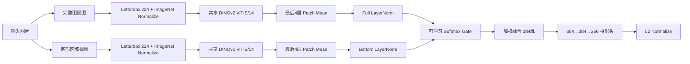

# Pattern 6541 新版图像编码器：模型结构与训练方法

本文说明 `PatternEncoderV3` 的最终模型结构、输入处理、特征提取、度量学习目标、分阶段训练方法和 prototype 推理方式。最终锁定模型使用 **DINOv2 ViT-S/14**，不是旧版 ResNet-18 编码器。

## 1. 任务定义

编码器接收一张拍立得图片，输出一个 256 维 L2 单位向量。分类器不使用固定类别数的 softmax head，而是将查询向量与候选 pattern prototype 计算余弦相似度：

\[
\hat c=\arg\max_c z_q^\top p_c
\]

其中：

- \(z_q\) 是查询图片的单位向量；
- \(p_c\) 是 pattern \(c\) 的单位 prototype；
- 新 pattern 只要提供少量参考图片即可注册，不需要重新训练分类头。

主要实现位于 [`pattern_encoder_v3.py`](../pattern_encoder_v3.py)。

## 2. 总体结构



模型由四部分组成：

1. 完整图和底部区域双视图；
2. 共享的 DINOv2 ViT-S/14 backbone；
3. 可学习双路门控融合；
4. 384→384→256 的度量学习投影头。

## 3. 输入与预处理

### 3.1 双视图

每张图片产生两个视图：

- `full`：完整图片；
- `bottom`：图片底部区域。

底部区域比例：

- 训练：在 40%–50% 之间随机抖动；
- 验证和推理：固定底部 45%。

底部区域不是从完整图 token map 中截取，而是作为独立高分辨率 crop 再运行一次共享 backbone。这样底部图案能够重新占满 224×224 输入，而不是只剩少数 patch token。

### 3.2 Letterbox

两个视图均保持原始长宽比，缩放后填充到 224×224。填充颜色取图片边界像素的中位颜色，减少固定黑边或白边造成的人工特征。

随后使用 ImageNet mean/std 标准化：

```text
mean = [0.485, 0.456, 0.406]
std  = [0.229, 0.224, 0.225]
```

### 3.3 保真增强

训练增强只使用不会改变 pattern 身份的操作：

- 小幅边缘扩展；
- ±3° 旋转；
- 亮度和对比度扰动；
- 颜色饱和度扰动；
- 低概率轻微高斯模糊。

没有使用水平翻转、强随机裁剪或会破坏图案结构的增强。

## 4. Backbone：DINOv2 ViT-S/14

最终模型通过 `timm` 加载：

```python
timm.create_model(
    "vit_small_patch14_dinov2",
    pretrained=True,
    num_classes=0,
    img_size=224,
)
```

主要规格：

| 项目 | 数值 |
|---|---:|
| 架构 | Vision Transformer Small |
| Patch size | 14×14 |
| 输入 | 224×224 |
| Patch grid | 16×16 |
| Patch token 数 | 256 |
| Backbone 特征维度 | 384 |
| 参数量 | 约 21.6M |

`PatternEncoderV3` 同时保留 ConvNeXt-Tiny 分支用于对照实验，但最终 checkpoint 的 backbone 是 `dinov2_vits14`。

## 5. DINOv2 特征读取方式

实验表明，DINOv2 最终 CLS token 不适合该细粒度 pattern 任务。最终模型读取最后 4 个 Transformer block 的 normalized patch tokens：

```python
layers = backbone.get_intermediate_layers(
    images,
    n=4,
    return_prefix_tokens=True,
    norm=True,
)

features = mean(
    mean(patch_tokens, dim=patch),
    dim=last_four_layers,
)
```

即：

\[
f(x)=\frac{1}{4}\sum_{l=L-3}^{L}
\left(\frac{1}{N}\sum_{i=1}^{N}t_{l,i}\right)
\]

其中 \(t_{l,i}\) 是第 \(l\) 层第 \(i\) 个 normalized patch token。

Stage0 冻结特征结果：

| 表示 | Seen | Novel 1-shot | Novel 5-shot |
|---|---:|---:|---:|
| DINOv2 final CLS Fusion | 32.41% | 12.31% | 25.62% |
| DINOv2 last-4 patch mean Fusion | 51.88% | 22.50% | 44.49% |

因此最终实现不使用 CLS token。252×252 输入也在配对实验中退化，最终固定 224×224。

## 6. 可学习双区域融合

完整图和底部图分别经过独立 LayerNorm：

\[
\tilde f_F=LN_F(f_F),\qquad \tilde f_B=LN_B(f_B)
\]

将两个 384 维特征拼接后输入 768→2 的线性门控：

\[
[w_F,w_B]=softmax(W[\tilde f_F;\tilde f_B]+b)
\]

融合特征：

\[
f_{fused}=w_F\tilde f_F+w_B\tilde f_B
\]

gate 权重初始化为旧模型的 Full 0.3 / Bottom 0.7：

```python
gate.weight = 0
gate.bias = [log(0.3), log(0.7)]
```

之后由训练数据自动学习。最终 Stage3 验证时的平均权重约为：

- Full：0.551；
- Bottom：0.449。

这说明最终模型同时依赖全局图案布局和底部局部信息，而不是继续使用人工固定比例。

## 7. 投影头与输出

投影头结构：

```text
LayerNorm(384)
→ Linear(384, 384)
→ GELU
→ Dropout(0.10)
→ Linear(384, 256)
→ L2 Normalize
```

输出：

\[
z=\frac{h(f_{fused})}{\|h(f_{fused})\|_2}
\]

所有查询向量和 prototype 都是单位向量，因此点积等于余弦相似度。

## 8. Name-aware episodic sampling

训练使用 source-group 隔离的 name-aware episode。

每个 episode：

1. 随机选择 8 个不同 name；
2. 每个 name 随机选择一个 pattern；
3. 每个 pattern 选择 4 个不同 source group；
4. 其中 2 个作为 support，2 个作为 query；
5. 每个 source group 随机选择一张图片。

因此标准 episode 为：

```text
8-way × (2 support + 2 query) = 32 images
```

先按 name 抽样可以避免同一 name 下的 P1/P2 在同一 episode 中被直接当作竞争负类。loss 内部仍保留 name mask，形成双重保护。

## 9. 损失函数

总损失：

\[
L=L_{prototype}+0.25L_{masked\_supcon}
\]

### 9.1 Prototype classification loss

每个 episode 内，由 support embedding 建立临时 prototype：

\[
p_c=normalize\left(\frac{1}{|S_c|}\sum_{i\in S_c}z_i\right)
\]

query logit：

\[
\ell_{q,c}=\frac{z_q^\top p_c}{\tau_p},\qquad \tau_p=0.07
\]

对 query label 计算交叉熵。

### 9.2 Name-masked supervised contrastive loss

温度：\(\tau_s=0.10\)。样本关系定义：

| 关系 | SupCon处理 |
|---|---|
| 相同 pattern | Positive |
| 相同 name、不同 pattern | Ignore，完全移出分母 |
| 不同 name | Negative |

同 name 的 P1/P2 既不是正例，也不是负例。

## 10. 分阶段训练

### Stage0：冻结特征选择

不更新模型，只比较：

- ResNet18；
- ConvNeXt-Tiny；
- DINOv2 的 CLS、patch mean、last-4 patch mean 等表示；
- Full、Bottom、固定融合三种区域方案；
- 224 与 252 输入尺寸。

结果确定使用 DINOv2 last-4 patch mean、224 输入。

### Stage1：训练融合头和投影头

- 冻结整个 backbone；
- 训练 Full/Bottom LayerNorm、gate 和 projector；
- DINOv2 与 ConvNeXt 使用相同预算比较。

| Backbone | Seen macro | Novel 1-shot | Novel 5-shot | Joint score |
|---|---:|---:|---:|---:|
| DINOv2 | 71.22% | 33.54% | 55.09% | 0.5777 |
| ConvNeXt-Tiny | 70.92% | 25.22% | 44.49% | 0.5289 |

Stage2 选择 DINOv2。

### Stage2：解冻最后 2 个 block

- 加载 Stage1 best 权重；
- 解冻 DINOv2 blocks 10–11 和 final norm；
- 重新创建 AdamW，不继承 Stage1 optimizer state；
- 80 episode/epoch；
- gradient accumulation 2；
- 每 2 epoch 完整验证。

Stage2 epoch 12：Seen macro 76.81%、Novel 1-shot 36.97%、Novel 5-shot 58.69%、score 0.62318。

### Stage3：解冻最后 4 个 block

- 解冻 blocks 8–11 和 final norm；
- 其余 backbone 冻结；
- 每个 epoch 完整验证，最多 8 epoch。

分层学习率：

| 参数组 | LR |
|---|---:|
| LayerNorm + gate + projector | 3e-5 |
| Backbone final norm | 5e-6 |
| Block 11 | 4e-6 |
| Block 10 | 3e-6 |
| Block 9 | 2.25e-6 |
| Block 8 | 1.7e-6 |

最终选择 Stage3 epoch 8。

## 11. 模型选择协议

联合分数：

\[
Score=0.50\times SeenMacro+0.25\times Novel1shot+0.25\times Novel5shot
\]

seen 与 novel 两大目标等权，novel 内部 1-shot 和 5-shot 等权。模型选择只使用 seen-validation 和 novel-dev；seen-test、novel-test 在锁模前不读取。

最终 Stage3 epoch 8 validation：

| 指标 | 数值 |
|---|---:|
| Seen Top-1 | 81.18% |
| Seen macro | 81.12% |
| Novel-dev 1-shot | 40.50% |
| Novel-dev 5-shot | 62.14% |
| Joint score | 0.66223 |

## 12. Prototype 构建

### 12.1 训练和严格评测

- Seen validation/test prototype 只使用 seen-train；
- Novel few-shot prototype 只使用指定 support source group；
- query 图片不进入 prototype。

### 12.2 全实例部署 prototype

部署交付时，每个 source group 等权：

\[
u_s=normalize\left(\frac{1}{|I_s|}\sum_{i\in I_s}z_i\right)
\]

\[
p_c=normalize\left(\frac{1}{|S_c|}\sum_{s\in S_c}u_s\right)
\]

先在 source 内平均，再跨 source 平均，可避免拥有多张近重复图片的单一 source 获得更高权重。

## 13. 最终测试结果

最终checkpoint在测试前锁定。

Seen test：

- Top-1：79.68%；
- Macro accuracy：79.05%；
- Macro F1：77.57%。

Novel-test固定公共61-pattern集：

| Shot | Accuracy |
|---:|---:|
| 1 | 23.97% |
| 2 | 33.31% |
| 3 | 38.59% |
| 5 | 45.18% |

限定12候选时：

- Seen完整prototype：90.30%；
- Novel 10-shot：72.72%。

## 14. 最终模型标识

- Checkpoint格式：`pattern_6541_stage3_checkpoint_v1`；
- Backbone：`dinov2_vits14`；
- Backbone特征：`last4_normalized_patch_mean`；
- 最终epoch：8；
- Embedding维度：256；
- checkpoint SHA-256：`fe5bcb95f15836ab8d664398ee7acede0fb700ce3ac85ffa0d60adf356a2fb01`。

本次Git提交只包含源码和报告，不包含checkpoint、prototype、图片、embedding或评测运行产物。

## 15. 相关源码

| 文件 | 用途 |
|---|---|
| [`pattern_encoder_v3.py`](../pattern_encoder_v3.py) | 模型、预处理和双视图结构 |
| [`prepare_pattern_6541_manifest.py`](../prepare_pattern_6541_manifest.py) | 数据清理与锁定划分 |
| [`evaluate_pattern_6541_stage0.py`](../evaluate_pattern_6541_stage0.py) | 冻结特征对照实验 |
| [`train_pattern_6541_stage1.py`](../train_pattern_6541_stage1.py) | Episode、loss、Stage1训练与验证 |
| [`train_pattern_6541_stage2.py`](../train_pattern_6541_stage2.py) | 最后2个block微调 |
| [`train_pattern_6541_stage3.py`](../train_pattern_6541_stage3.py) | 最后4个block分层学习率微调 |
| [`evaluate_pattern_6541_checkpoint.py`](../evaluate_pattern_6541_checkpoint.py) | 锁定checkpoint评测 |
| [`evaluate_pattern_6541_candidate12_known.py`](../evaluate_pattern_6541_candidate12_known.py) | 12候选known评测 |
| [`evaluate_pattern_6541_candidate12_unknown.py`](../evaluate_pattern_6541_candidate12_unknown.py) | 单阈值unknown评测 |
| [`build_pattern_6541_prototype_release.py`](../build_pattern_6541_prototype_release.py) | 全实例部署prototype构建 |
